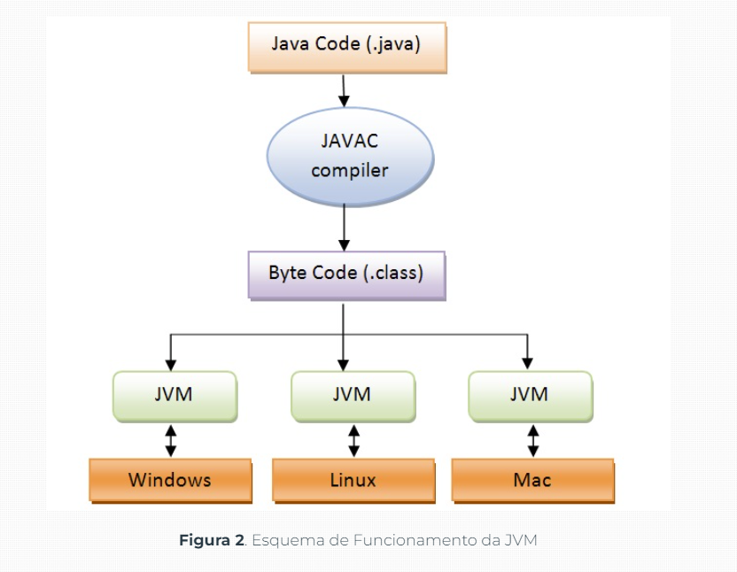
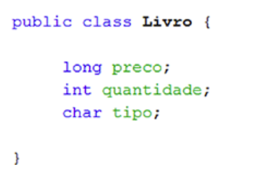
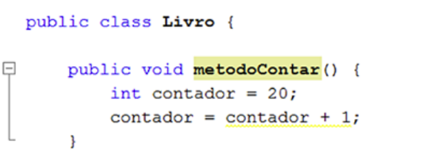
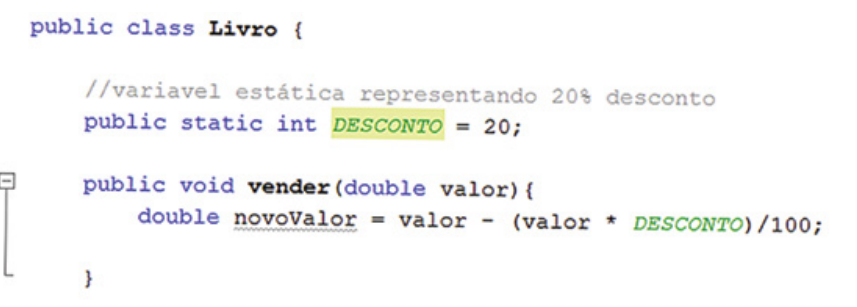
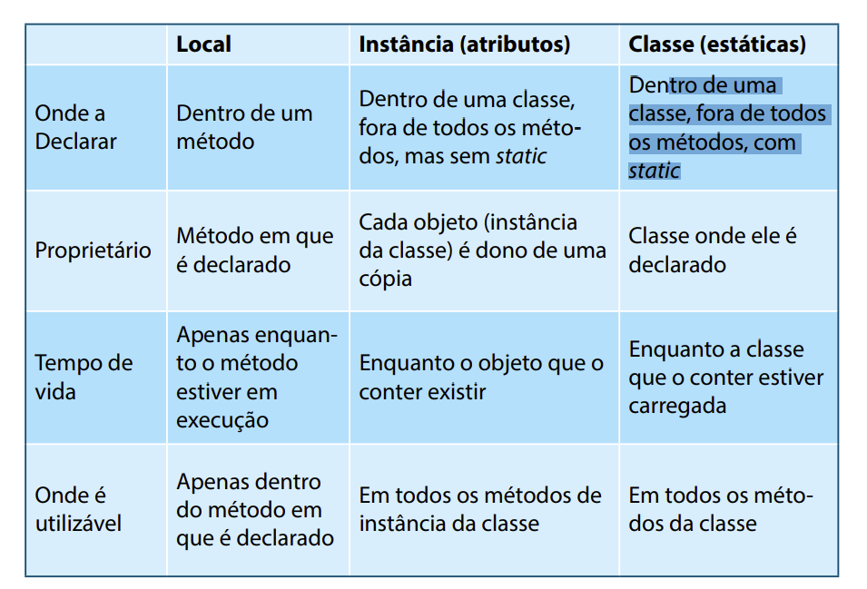
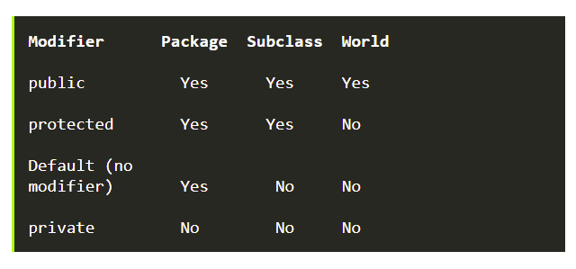
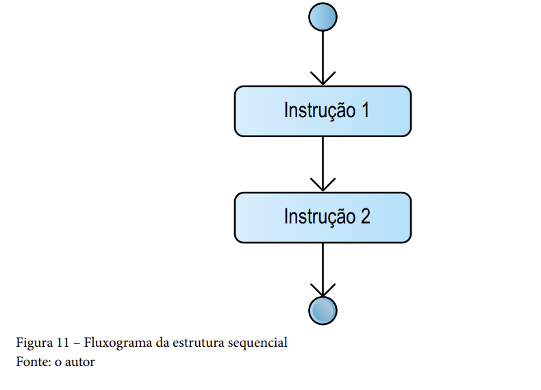
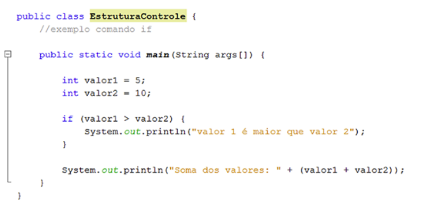

# Programacao 1 Unicesumar(Java)

## Capitulo 1 - apontamentos

- O Java elimina algumas construções de baixo nível, como ponteiros, além
  de possuir um modelo de memória muito simples, em que cada objeto é alocado em uma 
  pilha e todas as variáveis de tipos de objeto são referências. O seu
  gerenciamento de memória é feito por meio da coleta de lixo (Garbage Collector)
  automática realizada pela JVM.

- A plataforma Java consiste de vários programas. Cada programa fornece uma
  parcela de suas capacidades gerais. Por exemplo, o compilador Java, que 
  converte código-fonte Java em bytecode Java (uma linguagem intermediária para a
  JVM), é fornecido como parte do Java Development Kit (JDK). O Java Runtime
  Environment (JRE) complementa a JVM com um compilador just-in-time (JIT),
  que converte bytecodes intermediários no código de máquina nativo da plataforma alvo. 
  Um extenso conjunto de bibliotecas também forma a plataforma Java.

- Assim, os componentes essenciais da plataforma Java são: o compilador
  Java, as bibliotecas e o ambiente de tempo de execução em que o bytecode Java
  intermediário “executa” de acordo com as regras estabelecidas na especificação
  da máquina virtual.
- O coração da plataforma Java é a máquina virtual, que executa programas
  de bytecode Java. Este código é o mesmo, não importa em que sistema operacional 
  ou hardware o programa está sendo executado. O compilador JIT traduz
  o bytecode Java em instruções do processador nativo em tempo de execução e
  armazena o código nativo em memória durante a execução.

- Embora os programas Java sejam multiplataforma ou independente de plataforma, o 
  código da máquina virtual em que estes programas rodam não é. Cada
  plataforma operacional possui a sua própria JVM

- Compilador: programa responsável por traduzir código de uma linguagem alto nível para 
uma linguagem baixo nível;
    - Tradutor : programa que traduz um programa fonte escrito em uma linguagem qualquer
      (denominada linguagem fonte) para um programa objeto equivalente escrito em outra linguagem(denominada linguagem objeto.)
    - compilador: é um tradutor em  que a linguagem fonte é uma linguagem de alto nível e a linguagem objeto é uma
      linguagem baixo nivel(assembly ou máquina). Ex: C++ (ele precisa criar um código máquina para cada SO)
    - iNTERPRETADOR: É UM PROGRAMA QUE INTERPRETA DIRETAMENTE AS INSTruções do programa fonte, gerando o resultado.
      Ex: python, php...
    - Tradutor/Interpretador: esquema híbrido para implementação de linguagens de programação. Ex: java (tem uma etapa de
      tradução e outra de interpretação)

- O CLASSPATH: O Path (caminho em inglês) é uma variável de ambiente de um sistema operacional 
  que fornece a uma aplicação uma lista de pastas onde procurar por algum
  recurso específico

- O exemplo mais comum é o caminho para programas executáveis. A variável de ambiente CLASSPATH de
  Java é uma lista de locais que são visitados na
  procura por arquivos de classes. Tanto o interpretador Java como o compilador
  Java usa a CLASSPATH quando procura por pacotes e classes Java. 

- O INTERPRETADOR JAVA A interpretação de arquivos bytecode Java é a base para a criação de aplicações Java.

- A ASSINATURA DO MÉTODO MAIN( ): O método main( ) deve possuir a assinatura de método correta. A assinatura de
  um método é um conjunto de informações que define o método. Ela inclui o
  nome do método, seus argumentos e o tipo de retorno, assim como o modificador de visibilidade e tipo. O método main( ) deve ser público (public), estático
  (static) e receber um array de objetos Strings (textos, nesse caso sem espaço) e
  não deve retornar valor indicando com a palavra reservada void. Assim: public static void main (String[ ] argumentos)
- O fato de main( ) ser público e estático simplesmente significa que ele é acessível globalmente e que ele pode ser 
  chamado diretamente pelo nome. Quem o chama é o inicializador quando interpretamos o bytecode. 
- O único argumento do método main( ) é um array de objetos Strings, que
  serve para armazenar em cada entrada do array os parâmetros digitados pelo
  usuário após o nome da classe a ser interpretada. O nome do parâmetro pode
  ser escolhido pelo usuário (escolhemos “argumentos” no exemplo acima); mas
  o tipo deve ser sempre String[ ], que significa array de objetos String.

## Questões - capitulo 1

1. Por que o Java divulga tanto que os seus programas são “write once, run
   everywhere”? porque uma vez escritos e compilados em bytecodes, só é necessário uma JVM , ficando
    o programa independente de plataforma

a JVM além de ser um interpretador de código,  é também responsável pela execução das pilhas, gerenciamento de memória, 
threads e etc., ou seja, é um “computador virtual”. Uma de suas funções que podemos notar aqui é o Garbage Collector. 
Ele é uma thread responsável pela “limpeza” da memória virtual, ou seja, quando existe muito “lixo” na memória virtual, 
o Garbage Collector entra em ação. Porém, é difícil prever quando isso irá acontecer, por ele ser uma thread, como 
comentado anteriormente, e as threads são lançadas de acordo com o escalonador de processos.
   A JVM não entende código Java, e sim um código especifico chamado ByteCode, que é gerado pelo compilador Java (javac). 
 Esse código é o que será traduzido pela Virtual Machine para o código de cada máquina em questão. Os processos de 
execução de um software Java foram aperfeiçoados ao longo dos tempos, pois no início, a Virtual Machine interpretava
apenas um ByteCode por vez. Hoje em dia, a JVM possui sistemas de compilação JIT (Just - In - Time) misturados com a 
interpretação do código. Essa técnica cria os chamados “Hot-Spots”, que nada mais são que áreas de código executadas 
com maior frequência. Isso ocorre com a análise dos ByteCodes à medida que eles são interpretados pela Virtual Machine.
            
2. Quais as principais características do Java 5? O que mudou nos programas já existentes até o momento do seu lançamento?
   As principais características estão relacionadas à sintaxe da linguagem, com as seguintes melhorias: 
   - for enhanced(loop for aprimorado), 
      for(declaration : expression) {
     // Statements
     }
   - generics :trouxe funcionalidades interessantes para o reuso de código. Agora, podemos criar uma classe só e, a 
   partir dessa classe, instanciar objetos de diferentes tipos, de acordo com a nossa escolha
   
   - autoboxing.
     Com a introdução do autoboxing e unboxing em Java, essa conversão primitiva para objeto acontece automaticamente 
     pelo compilador Java, o que torna o código mais legível.

4. O que é JCP? Como você pode fazer para submeter uma mudança que você considera importante para futuras versões de Java?
   JCP é a Java Community Process. Para submeter uma mudança, uma pessoa deve propor uma JSR (Java Specification Release) e enviar à JCP.

5. Quais plataformas compõem a tecnologia Java? Forneça uma pequena descrição de cada uma delas.
  - Java SE para o desenvolvimento de sistemas desktop e distribuídos; 
  - Java EE para aplicações corporativas Web e de componentes de negócio; 
  - Java ME para o desenvolvimento de aplicações para dispositivos móveis.
  - Java Card. Voltada para dispositivos embarcados com limitações de processamento e armazenamento, como smart cards e o Java Ring.
  - JavaFX. Plataforma para desenvolvimento de aplicações multimídia em desktop/web (JavaFX Script) e dispositivos móveis (JavaFX Mobile).

6. Explique o que é bytecode e como ele deve ser “lido” para permitir que um programa Java seja executado.
   Bytecode é o código gerado pelo compilador Java. Ele é interpretado por meio
   das instruções presentes na máquina virtual Java.

7. Explique, com as suas palavras, o processo de compilação, interpretação e execução de programas Java. Dica: faça uma ilustração.
   Após escrito o código .java, ele é compilado por meio do compilador Java gerando o bytecode .class . O bytecode é 
   então carregado e interpretado pela JVM que executa suas instruções.
   

8. Por que o classpath é tão importante para o Java?
   O classpath indica o local exato onde estão disponíveis todas as classes necessárias para que um programa seja 
   compilado e executado.

## Capitulo 2 - ESTRUTURAS BÁSICAS DA LINGUAGEM JAVA

- O QUE SÃO TIPOS PRIMITIVOS?  Um primitivo (valor primitivo, tipo de dados primitivo) é um dado que não é representado 
   através de um Objeto e, por consequência, não possui métodos. Os tipos primitivos são boolean, byte, char, short, 
   int, long, float e double. 
- DECLARAÇÃO DE VARIÁVEIS: Java é uma linguagem de programação fortemente tipada. Isto significa que
  cada variável deve ter um tipo de dado associado a ela.
- ESCOPO DE VARIÁVEL: O conceito escopo de variável descreve a vida de uma variável, ou seja, refere-se à
  acessibilidade de uma variável. É a parte do programa em que o nome da variável pode ser referenciado. 
    - VARIÁVEIS DE INSTÂNCIA (ATRIBUTOS): As variáveis de instâncias são definidas dentro da classe, mas fora de qualquer
      método, e só são inicializadas quando a classe é instanciada. Elas são os campos que pertencem a cada objeto.
      
        
  
    - Variáveis Locais: As variáveis locais são as declaradas dentro de um método. Da mesma forma
      que a variável local inicia sua existência dentro do método, ela também é eliminada quando a execução do método é concluída. Não há palavra-chave especial
      que designa uma variável como local; a determinação vem inteiramente a partir do local em que a variável é declarada - que é entre as chaves de abertura e
      fechamento do método.As variáveis locais só são visíveis para os métodos em que são declaradas,
      não são acessíveis a partir do resto da classe. Por isso elas não utilizam a maioria dos modificadores e acessos como public, abstract, static etc., porém ela pode
      fazer uso do modificador final.A variável local precisa ser inicializada para ser usada. 
      A sintaxe para declarar uma variável local e inicializá-la é semelhante ao declarar um campo.
      
  
    - Variáveis de Classe (Estáticas)Variáveis de classe, também conhecidas como variáveis estáticas, são declaradas
      com a palavra-chave static em uma classe, mas fora de um método construtor
      ou um bloco. O modificador static diz ao compilador que há apenas uma cópia
      de cada variável de classe por classe, independentemente de quantos objetos são
      criados a partir dele. na declaração de uma variável dentro de uma classe, para se criar uma variável 
      que será compartilhada por todas as instâncias de objetos de uma classe como um variável comum.
      Variáveis e métodos marcados como static pertencem à classe, ao invés de alguma instância particular.
        
  
  ## COMPARANDO OS ESCOPOS DE VARIÁVEL

## modificadores de acesso
 
 
## ESTRUTURAS DE CONTROLE

Quando você compila e executa um programa Java, a JVM executa o que está
dentro do método principal. Estas instruções são realizadas sequencialmente.
Um programa de computador (algoritmo) é como uma receita: uma sequência
de instruções

Estruturas de controle são instruções que permitem que blocos específicos
de código sejam escolhidos para serem executados, redirecionando determinadas 
partes do fluxo do programa. O Java contém três tipos de estruturas de
controle: 
- instruções de sequência:Normalmente instruções em um programa são executadas uma após a outra na
  ordem em que são escritas. Somente programas muito simples são estritamente
  sequenciais.

- instrução de seleção (if, if else, switch)
  Diretivas são as instruções que a linguagem Java fornece para a construção de
  programas. Elas são separadas por ; (ponto e vírgula).
  Vejamos um exemplo de um código utilizando a instrução if.

  Uma estrutura muito utilizada em programação é o switch. A instrução switch
  verifica uma variável e trabalha de acordo com seus cases. Os cases são as possibilidades
  de resultados que são obtidos por switch.Basicamente, o switch serve para controlar várias ações diferentes de acordo
  com o case definido dentro dele

- instruções de repetição (while, do-while, for).
  Os loops da linguagem Java permitem que você repita a execução de um bloco
  de código até que uma determinada condição seja verdadeira ou durante uma
  quantidade específica de iterações.
  O loop for será particularmente útil para o controle do fluxo quando você já souber quantas vezes terá de executar as 
  instruções do bloco do loop. A figura abaixo apresenta a estrutura do comando for.
  O loop while será adequado em cenários nos quais você não souber quantas
  vezes o bloco ou instrução terá que ser repetido.
  O do while difere do while no sentido de permitir que pelo menos uma execução do bloco de comandos seja executada 
  antes de testar a condição. O bloco de comandos será executado enquanto a condição for verdadeira.

## DESVIOS INCONDICIONAIS

O Java só tem dois casos específicos de desvios incondicionais: break e continue.
Break e continue são dois comandos de controle de estruturas largamente utilizados em loops (repetições), como for e while.

Break - O comando break tem a função de interromper a execução de um loop. No
comando switch, por exemplo, ele determina que não pode ser executado o case
seguinte, e assim por diante.

Continue  - O comando continue tem a função de fazer com que a condição do comando de
loop seja novamente testada, mesmo antes de alcançar o fim do comando. 